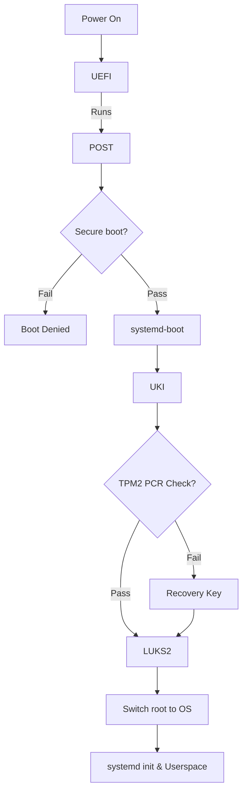

<h1 align="center">
  <a href="https://github.com/Aldin-Dreamer/Arch-Hypr-Vault">
    
  </a>
</h1>

<div align="center">
  Arch Linux — Seamless LUKS Encrypted Boot with TPM2 Auto-Unlock and Secure Boot
  <br />
  <br />
  <a href="https://github.com/Aldin-Dreamer/Arch-Hypr-Vault/issues/new?assignees=&labels=bug&template=01_BUG_REPORT.md&title=bug%3A+">Report a Bug</a>

<div align="center">
<br />

[](LICENSE)
[](https://github.com/Aldin-Dreamer/Arch-Hypr-Vault/issues?q=is%3Aissue+is%3Aopen+label%3A%22help+wanted%22)
[](https://github.com/Aldin-Dreamer)

</div>

---

An installation guide for security focused users who want a seamlessly encrypted system with LUKS encryption, TPM2 auto unlock and secure boot. This guide is meant to be used alongside the official ArchWiki Installation guide. This guide will cover how the setup works and how to replicate it yourself. Filesystem and tooling choices are also made with day-to-day usability in mind — such as Btrfs for snapshot-based rollbacks.

> ⚠️ **Warning:** This process involves disk partitioning and will erase all data
> on the target drive. Back up anything important before proceeding. There is also
> a real risk of bricking your system — read the entire guide at least once before
> running any commands. The automated scripts may also have bugs or behave
> differently across hardware.

---

<details open="open">
<summary>Table of Contents</summary>

 [Repo Structure](#1-repo-structure)<br>
 [What This Setup Achieves](#2-what-this-setup-achieves)<br>
 [Prerequisites](#3-prerequisites)<br>
 [How It All Fits Together](#4-how-it-all-fits-together)<br>
 [Disk Partitioning](#5-disk-partitioning)<br>
 [LUKS2 Encryption](#6-luks2-encryption)<br>
 [Btrfs Setup](#7-btrfs-setup)<br>
 [Base System Installation](#8-base-system-installation)<br>
 [System Configuration](#9-system-configuration)<br>
 [Bootloader — systemd-boot](#10-bootloader--systemd-boot)<br>
 [Unified Kernel Image (UKI)](#11-unified-kernel-image-uki)<br>
 [Secure Boot](#12-secure-boot)<br>
 [TPM2 Enrollment](#13-tpm2-enrollment)<br>
 [Snapper — Btrfs Snapshots](#14-snapper--btrfs-snapshots)<br>
 [Post-Installation Checklist](#15-post-installation-checklist)<br>
 [Recovery Guide](#16-recovery-guide)<br>
 [Troubleshooting](#17-troubleshooting)<br>
 [Desktop Setup](#desktop-setup)<br>
 [Contributing](#contributing)<br>
 [Authors & Contributors](#authors--contributors)<br>
 [License](#license)<br>
 [Acknowledgements](#acknowledgements)<br>
 
</details>

---
</div>

## 1. Repo Structure

```
Arch-Hypr-Vault/
├── .gitignore
├── LICENSE
├── README.md
├── RICE.md
├── .config/
└── docs/
    └── images/
        └── logo.svg
```

---
<div align="center">

## 2. What This Setup Achieves

**Security & Boot**

| Feature | Implementation |
|---|---|
| Full disk encryption | LUKS2 |
| Automatic unlock at boot | TPM2 via `systemd-cryptenroll` |
| Fallback unlock | LUKS passphrase |
| Protection against Evil Maid attacks | Secure Boot with personal keys via `sbctl` |
| Bootloader | `systemd-boot` |
| Unified boot image | UKI — kernel + initramfs + cmdline in one signed `.efi` |

**Desktop & Personal Choices** *(swap these out for your own preferences)*

| Feature | Implementation |
|---|---|
| Filesystem | Btrfs |
| Snapshot support | Snapper |
| Windows Manager | Hyprland |

>🔒**Security Scope:** This setup will protect your data at rest i.e, if your device gets stolen or is physically tampered with by malicious actors. It wont however protect your setup when it is powered on and running, so you are still vulnerable to attacks from the internet, malware and even when your laptop is stolen while it is powered on. For that you need additional measure such as a firewall, keeping you system updated and not leave it powered on in public places.


---

## 3. Prerequisites

**You will need:**
<div align="left">
  <ul>
    <li>A UEFI system (legacy BIOS doesn't support this setup)</li>
    <li>A TPM2 chip (You can check if you have it <a href="https://wiki.archlinux.org/title/Trusted_Platform_Module#Checking_TPM_support">here</a>)</li>
    <li>You are expected to have read the <a href="https://wiki.archlinux.org/title/Installation_guide">ArchWiki Installation Guide</a> and meet its prerequisites.</li>
    <li>A lot of free time especially if you are new. Dont rush this.</li>
  </ul>
</div>

> 📝 **Note:** I will be using the ArchWiki syntax so commands prefixed with `#` are run as root and `$` are run as user. In the Arch ISO you are already root so no `sudo` is needed. After installation, use `sudo` where required.

---

## 4. How It All Fits Together
**The Chain of Trust**


<div align="left">
  
**UEFI** — The UEFI is the firmware required to boot the computer. It is the root of trust, that's why physical access to the chip compromises the system regardless of software security.

**POST** — POST stands for power on self test. The firmware checks that all hardware is present and functional before handing control to the boot process. Not directly part of the chain of trust but included here for completeness.

**Secure Boot** — Before loading anything from disk, the firmware checks the cryptographic signatures on the bootloader and then the UKI before allowing them to run. If any modification has been identified, it will deny boot.

**systemd-boot** — In this setup, the systemd-boot only acts as an interface for the UKI. Its only job is to find and load the UKI

**Unified Kernel Image (UKI)** — UKI bundles the kernel, initramfs, microcode, etc., into a single EFI executable file so it can be signed by a single cryptographic signature that prevents tampering with the file. This wouldn't be possible if they were kept as separate files since each would need to be signed and verified independently, leaving gaps an attacker could exploit.

**TPM2 PCR Check** — The initramfs asks the TPM2 chip to release the LUKS key used to decrypt the LUKS volume.  The TPM checks PCR 7 (Secure Boot state and keys) and PCR 11 (the exact UKI that was loaded). If both match what was recorded at enrollment time it releases the key. If anything in the boot chain changed the PCR values won't match and the TPM refuses.

**LUKS2** — LUKS2 is the encryption scheme being used for disk encryption. Once the TPM2 releases the key, the LUKS volume will be decrypted and the root partition becomes accessible. When TPM2 refuses due to mismatch, you will simply be prompted to manually enter the LUKS key. The decrypted volume is mapped to /dev/mapper/root which the system then mounts as the root filesystem.

**Switch Root & Userspace** — The initramfs hands control over to the actual root filesystem and the Linux boot process continues as normal. systemd starts, bringing up all system services in order until the system is fully operational and ready for login.
</div>

---

## 5. Disk Partitioning

Before we begin, it is important to visualize how disk space and partitions work: <br><br>
**[ Partition 1 | Partition 2 | *Free Space* | Partition 3 | *Free space* ]** <br><br>
Given this partition layout, there is an important distinction to make here - the memory is discontinuous. If you want to increase the size of partition 2 in the future, you can only increase it upto the space in front of it, i.e, you cannot use the space available after partition 3 to increase the size of partition 2. This is why we make EFI partition first and root partition last so we can extend it if needed or even shrink it (Though i must add there is a complication in extending and shrinking partitions in this specific setup due to the LUKS encryption).

> There is a way to move partitions, but it is risky and involves rewriting the entire contents of the partition to where you want to move it. This takes a long time and there is a significant risk of data loss.<br>
> 📖 **Further reading:** [Moving Partitions — ArchWiki](https://wiki.archlinux.org/title/Fdisk#Moving_partitions)
<div align="left">

>🧠**Extra — TRIM:** SSDs store data in cells that must be erased before they can be written to again. Without TRIM, the SSD doesn't know which blocks are free until it tries to write to them, forcing an erase-then-write cycle that slows performance and wears out cells faster over time. TRIM tells the SSD which blocks are no longer in use so it can erase them in advance, keeping write performance consistent and extending the drive's lifespan. To see if your device supports TRIM, run the below command and check the values of DISC-GRAN (discard granularity) and DISC-MAX (discard max bytes) columns. Non-zero values indicate TRIM support.
>```bash
># lsblk --discard 
>```
</div>
  
💡**Optional — Disk Preparation:** If you want the maximum security in exchange for longevity of your SSD, it is recommended to securely erase your drive before encryption by overwriting the entire device with random data. Note that, if you do this step you cannot use TRIM. Using TRIM would just undo this step and hence you would be simply causing wear on your SSD by performing such a large write operation. TRIM helps with longevity of your SSD, so it is recommended for most users that do not use HDD to use TRIM.

To securely erase your drive, follow the steps in this article: [Secure Erasure of the drive — ArchWiki](https://wiki.archlinux.org/title/Dm-crypt/Drive_preparation#Secure_erasure_of_the_drive)

 5.1 Partition Sceheme
 ---

Follow the Arch Wiki Installation Guide till <a href="https://wiki.archlinux.org/title/Installation_guide#Update_the_system_clock">Updating the system clock — ArchWiki</a>

The recommended partition strategy for this setup is:
| Mount Point | Partition type | Recommended Size |
|---|---|---|
| /boot | EFI Partition | 1 GiB |
| / | Root Partition | Remainder of the space. At least 23-32 GiB |

**EFI Partition -** The EFI partition is where the Unified Kernel Image(UKI) lives with the kernel, initramfs and microcode. It is recommended to use 1 GiB for future-proofing, so if you can spare it - do it. The UKI is pretty big (~100-150 MiB) so if you plan to put multiple kernel entries, the 1 GiB headroom will be useful. If you have space constraints, you can use 512 MiB instead.

**Root Partition -** This is where the main filesystem lives and hence where you will store most of your data. The size for this partition will generally be whatever you have remaining, so choose a size as per your use case.
<!-- Mention Zram as an alternative -->
> 📝**Note:** A swap partition is not recommended. An unencrypted swap partition will hold onto data when you shut down, so anything that the kernel places into the swap file during normal operation will be saved unencrypted. If you do need swap, I recommend to use a swap file instead - it will lie under the LUKS encryption and provide the functionality of swap without compromising security. If you still require a swap partition, I recommend reading: [Swap Encryption — ArchWiki](https://wiki.archlinux.org/title/Dm-crypt/Swap_encryption)

 5.2 Creating the partitions
 ---

> ⚠️**Warning:** The following steps will wipe the disk!! Backup anything you wish to save.

The steps vary for users who are dual booting. For dual booting with windows (other dual booters are also recommended to read this), see [docs/dual-boot-windows.md](docs/dual-boot-windows.md). The following is for users on a new disk or users who are gonna wipe the entire drive for a fresh install:

Before starting with the partitoning,run: 
<div align="left">
  
```bash
# lsblk
```
</div>

You can identify which block device your disk was assigned to (Most commonly it is /dev/sda or /dev/nvme0n1). In the following steps replace '*/dev/[device]*' with your block device.<br><br>

💡**Optional — 4096 Native Sector Size:** Most solid state drives (SSD) report their logical sector size as 512 bytes, even though they use larger sector size physically. If your SSD support 4096 bytes sector size, it is recommended to format it before partitioning to improve both the performance and lifespan of your SSD. Check if it supported by running:
>⚠️**Warning:** This specific step will wipe your entire disk and not just partitions, I am warning you again to backup anything you wish to save.
>
>If you are using a USB attached external drive, read [Advanced Format — ArchWiki](https://wiki.archlinux.org/title/Advanced_Format#Advanced_Format_hard_disk_drives) before deciding to change your sector size. There are some NVMe SSD that report they support 4096 bytes sectors but they encounter unstability especially under random heavy read load. If encountering this issue, simply revert back to 512 byte sector configuration.
<div align="left">
  
  ```bash
# nvme id-ns -H /dev/[device] | grep "Relative Performance"
---------------------------------------------------------------------------------------------------------------------------------

LBA Format  0 : Metadata Size: 0   bytes - Data Size: 512 bytes - Relative Performance: 0 Best (in use)
LBA Format  1 : Metadata Size: 0   bytes - Data Size: 4096 bytes - Relative Performance: 0 Best 
```
</div>
If you see a format with 4096 bytes, thats your native sector size. If it is supported but shows 512 bytes format is in use, you can change it by running:
<div align="left">

```bash
# nvme format --lbaf=1 /dev/[device]
----------------------------------------------------------------------------------------------------------------------------------
You are about to format [device], namespace 0x1.
WARNING: Format may irrevocably delete this device's data.
You have 10 seconds to press Ctrl-C to cancel this operation.

Use the force [--force] option to suppress this warning.
Sending format operation ... 
Success formatting namespace:
```
</div>
Then verify that your logical sector size changed:
<div align="left">

  ```bash
# nvme id-ns -H /dev/[device] | grep "Relative Performance"
---------------------------------------------------------------------------------------------------------------------------------

LBA Format  0 : Metadata Size: 0   bytes - Data Size: 512 bytes - Relative Performance: 0 Best 
LBA Format  1 : Metadata Size: 0   bytes - Data Size: 4096 bytes - Relative Performance: 0 Best (in use) 
```
</div>


Now to begin partitioning your chosen drive,run:
<div align="left">
  
```bash
# fdisk /dev/[device]
```
</div>

You will enter an interactive command-line interface (CLI), you can type 'm' to get the full list of commands.

<div align="left">

- The basic commands you will use are given below: 
> → — Separates consecutive steps, each entered at a separate fdisk prompt. <br>
> ↵ — leave the field blank and press Enter to accept the default value.
```bash
1. New GPT Table:               g
2. Print the partition table:   p
3. Delete Partition:            d → [partition_number]
4. EFI Partition:               n → ↵ (This will be your EFI_partition_number) → ↵ → +1G (Size of the partition)
5. Root Partition:              n → ↵ (This will be your root_partition_number) → ↵ → ↵ (This will allocate all the remaining free space available to the disk) 
6. EFI Type:                    t → [EFI_partition_number] → 1 (changing the partition_type to EFI system) 
7. Save & Exit:                 w
8. Exit without saving:         q
```
>📝**Note:**  After the EFI partitioning step if your partition contains filesystem data from previous Operating System, you might be prompted to remove vfat signature. Type 'Y' to delete the signature to ensure a clean partition
- Your final partition table should look like this:
```bash
# fdisk -l
---------------------------------------------------------------------------------------------------------------------------------
Disk /dev/[device]: [size] GiB, [bytes] bytes, [total_sectors] sectors
Disk model: [Manufacturer_model_name]              
Units: sectors of 1 * 512 = 512 bytes
Sector size (logical/physical): 512 bytes / 4096 bytes
I/O size (minimum/optimal): 512 bytes / 512 bytes
Disklabel type: [gpt/dos]
Disk identifier: [UNIQUE-ID-OR-GUID]
  
Device                                 Start        End        Sectors   Size       Type
/dev/[device][EFI_partition_number]    2048       [sector]     [count]    1G    EFI System
/dev/[device][root_partition_number]  [sector]    [sector]     [count]  [size]  Linux filesystem
```
</div>


---

## 6. LUKS2 Encryption

Once the partitions have been created, each newly created partition must be formatted with an appropriate file system. 
For the EFI partition, we will format it with FAT32 filesystem. This is the recommended option as the choice of filesystem needs to adhere to [UEFI specifications](https://uefi.org/specs/UEFI/2.11/13_Protocols_Media_Access.html#file-system-format-1). To create it, run:
>⚠️**Warning:** Only format the EFI system partition if you created it during the partitioning step. If there already was an EFI system partition on disk beforehand, reformatting it can destroy the boot loaders of other installed operating systems.
<div align="left">

```bash
# mkfs.fat -F 32 /dev/[device][EFI_partition_number]
```
</div>

For the root partition, before we create the filesystem, we need to encrypt it. We are encrypting the partition by writing a LUKS2 header at the beginning of it, turning it into a LUKS volume. The header stores the encryption metadata and key slots, and everything after it would be encrypted data. To create the LUKS volume, run:
>📝**Note:** In the previous section, if you did not do the optional step of changing the logical sector size of you SSD, omit the *--sector-size 4096* in the below command.
<div align="left">
  
```bash
# cryptsetup luksFormat --sector-size 4096 /dev/[device][root_partition_number]
```
</div>
You will be prompted to enter a password for unlocking the encryption. This will be your fallback passphrase if the TPM2 auto-unlock fails.

>❗**IMPORTANT:** Make sure to use a sufficiently secure password. Even though the keyslot will be wiped later, SSD wear-leveling can cause it to persist after removal for an indefinite amount of time. Also make sure to physically write this down or save it somewhere secure, if you lose this passphrase and TPM2 auto-unlock fails — you will be locked out of your system forever with no way to recover it.

Now to create the filesystem for root partition, first open the LUKS volume to access the root partition. Run the command and enter the password:
<div align="left">
  
```bash
# cryptsetup open /dev/[device][root_partition_number] root
```
</div>

You can verify if your root partition has been successfully encrypted by running lsblk. Instead of the root partition you created, you will see /dev/mapper/root:
<div align="left">

```bash
# lsblk
```
</div>

Then create a filesystem on the unlocked root partition. This is where you can choose your preferred filesystem. If you are following this guide exactly, it would be the btrfs filesystem. 

> 📖 **Filesystem Reference:** Watch this [beginner friendly overview](https://www.youtube.com/watch?v=4kMt5RtDZ7g) or read the [File Systems — ArchWiki](https://wiki.archlinux.org/title/File_systems#Types_of_file_systems) for a detailed comparison. If you choose a different filesystem, replace mkfs.btrfs in the command below with the appropriate command for your choice.
<div align="left">
  
```bash
# mkfs.btrfs /dev/mapper/root
```
</div>
Then mount both the root partition and EFI partitions:
<div align="left">
  
```bash
# mount /dev/mapper/root /mnt
# mount --mkdir /dev/[device][EFI_partition_number] /mnt/boot
```
</div>

## 7. Btrfs Setup
> 📝**Note:** This section is only relevant to you if you chose btrfs as your filesystem while formatting your root partition. Others can skip to the next section.

**Btrfs Subvolumes** — They function like independent filesystems that can be mounted separately in a hierarchy, providing the benefits of partitions without being actual physical partitions. Because the subvolumes work at the filesystem level rather than the block level, they can be dynamically resized as needed making them more flexible. Note that, because subvolumes are at the filesystem level, the subvolumes combined are limited by the storage space of the physical partition they are occupying. This is especially useful in this setup as we can encrypt them with a single LUKS passphrase.
 
💡**Suggested Btrfs Filesystem Layout:**

| Subvolume | Mountpoint | Purpose | CoW | Snapshots | Compression |
|---|---|---|---|---|---|
| @ | / | **The OS Core**. Allows for full system rollbacks without affecting your user-space data. | Yes | Yes | Yes |
| @home | /home  | **User Space**. Ensures your data remains in the "present" even if the OS is rolled back.  | Yes | Yes | Yes |
| @snapshots | /.snapshots | **Time Machine**. A dedicated storage for snapshots. Keeps recovery points isolated from the active OS. | Yes | No | Yes |
| @var_log | /var/log | **Troubleshooting**. Preserves system logs across rollbacks. Essential for troubleshooting failure after a restore. | Yes | No | Yes |
| @var_cache | /var/cache | **Package Archive**. Saves disk space by keeping temporary files and package archives separate | Yes | No | Yes |
| @swap | /swap | **Swap**. Swapfile to prevent "Out of memory" crashes when RAM is full. Regardless of how much RAM you have, the Linux kernel is designed to manage background tasks more efficiently with swap . Excluded from snapshots to prevent filesystem errors and overhead. | No | No | No |

> 📝**Note:** In swap subvolume, CoW, compression, snapshots are all disabled because all three actively break or hurt swapfile performance. Btrfs actively forbids activating a swapfile on a CoW or compressed file.

>🧠**Extra:** If you ever plan to tinker with a Virtual Machine (VM), I suggest making a separate subvolume for the VM and disabling CoW (copy on write), snapshots and compression. This is because VM images are massive files that are constantly being written to. The COW feature of btrfs can cause massive fragmentation on these large files, similarly, snapshots and compression can hurt performance.
>
> | Subvolume | Mountpoint | CoW | Snapshots | Compression |
> |---|---|---|---|---|
> | @libvirt | /var/lib/libvirt/images | No | No | No |

To create the subvolume, run:
<div align="left">
  
```bash 
# btrfs subvolume create /path/to/subvolume
---------------------------------------------------------------------------------------------------------------------------------
btrfs subvolume create /mnt/@
btrfs subvolume create /mnt/@home
btrfs subvolume create /mnt/@snapshots
btrfs subvolume create /mnt/@var_log
btrfs subvolume create /mnt/@var_cache
btrfs subvolume create /mnt/@swap
btrfs subvolume create /mnt/@libvirt
```
</div>

We can mount the subvolumes with its corresponding mount options. The commonly used options are:
<div align="left">
  
- ```subvol=PATH``` — mounts subvolume based on its relative path from top-level root. Without this options, Btrfs will default to mounting it to top-level root.
- ```compress=<type[:level]>``` — Enables compression and automatically evaluates each file's compressibility and skips compression for files that don't compress well. When you read the file, the processor will decompress it on the fly.
- ```noatime``` — Linux kernel automatically assigns metadata to each file and one of them is atime. It records the last accessed time, this introduces unnecessary writes whenever you open a file. For Btrfs it is recommended to use this option to disable atime.
- ```discard``` — Enable discarding of freed file blocks. This is useful for SSD/NVMe devices, thinly provisioned LUNs, or virtual machine images; however, every storage layer must support discard for it to work. In HDD, the mount option is inherently useless and will be ignored. 
  - ```discard=sync``` discards the file, the moment you delete a file.
  - ```discard=async``` queues the file for deletion and is only deleted when the storage drive becomes idle, improving perfomance. Because of this, it is recommended over synchronous mode. This option is enabled by default from Linux 6.2 onwards, we are explicitly adding it as a mount option in the below commands to ensure ```genfstab``` detects it and write it to the fstab file.
  - ```nodiscard``` disables TRIM support, if you want to prevent forensic tracking risks in exchange for performance and longevity.
</div>

> 📖 **For the full options list:** [Mount options — ArchWiki](https://man.archlinux.org/man/btrfs.5#MOUNT_OPTIONS)

First we have to unmount the top-level directory and remount it with the ```subvol``` option pointing to @ so that the subvolume becomes your root directory. Then you create the corresponding mountpoint directory for each subvolume and mount the subvolume with their corresponding options. Run:
<div align="left">
  
```bash
# umount /mnt/boot 
# umount /mnt

# mount -o subvol=@,compress=zstd,noatime,discard=async /dev/mapper/root /mnt

# mkdir -p /mnt/{boot,home,.snapshots,var/log,var/cache,swap,var/lib/libvirt/images}

# mount -o subvol=@home,compress=zstd,noatime,discard=async /dev/mapper/root /mnt/home
# mount -o subvol=@snapshots,compress=zstd,noatime,discard=async /dev/mapper/root /mnt/.snapshots
# mount -o subvol=@var_log,compress=zstd,noatime,discard=async /dev/mapper/root /mnt/var/log
# mount -o subvol=@var_cache,compress=zstd,noatime,discard=async /dev/mapper/root /mnt/var/cache
# mount -o subvol=@libvirt,noatime,discard=async /dev/mapper/root /mnt/var/lib/libvirt/images
# mount -o subvol=@swap,noatime,discard=async /dev/mapper/root /mnt/swap

# mount /dev/[device][EFI_partition_number] /mnt/boot
```
</div>

You must disable CoW before writing any data to the subvolume. If you enable it after, the existing data will retain CoW properties. To disable CoW on a subvolume, run:
<div align="left">
  
```bash
# chattr +C /path/to/subvolume_mountpoint
---------------------------------------------------------------------------------------------------------------------------------
# chattr +C /mnt/var/lib/libvirt/images
# chattr +C /mnt/swap
```
</div>

To verify that CoW has been disabled, run:
<div align="left">
  
```bash
# lsattr -d /mnt/swap
---------------------------------------------------------------------------------------------------------------------------------
---------------C------ /mnt/swap
```
</div>

If the output comes with a capital 'C' then it means CoW has been disabled. This will persist after unmounting, rebooting and system updates.

To make the @swap subvolume a swapfile, run:
<div align="left">
  
```bash
# btrfs filesystem mkswapfile --size [size]g --uuid clear /mnt/swap/swapfile
# swapon /mnt/swap/swapfile
```
>📝**Note:** The ```swapon``` command only activates swap for the current session. To make it persisten across reboots, it needs to be added to fstab which will be done in the next section.

>💡**Swapfile size recommendation:** The size of swapfile depends on the amount of RAM your system has and whether you want to hibernate (suspend to disk).
> - If you want to hibernate, then the swapfile should have the same size as the amount of RAM plus some safety margin for headroom. If you use hibernation with memory compression, then you will need more space, the golden rule will be ```size of RAM + sqrt(size of RAM)```.
> - If you do not want to hibernate (Recommended for most users), then the swapfile only needs to be 4 to 8 GiB depending on the amount of RAM. 4 GiB for 8 and 16 GiB RAM and 8 for 32+ GiB of RAM.
</div>

To verify swap has been activated, run the below command and a similar output will be seen:
<div align="left">
  
```bash
# swapon --show
---------------------------------------------------------------------------------------------------------------------------------
NAME           TYPE      SIZE USED PRIO
/swap/swapfile file      4.0G   0B   -2
```
</div>

---

## 8. Base System Installation

### Install essential packages

At this stage you need to install some essential packages aside from the base package for your setup:
<div align="left">
  
- [CPU Microcode](https://wiki.archlinux.org/title/Microcode) — Depending on if your processor is amd or intel, you need to install its microcode. Processor manufacturers release stability and security updates to the processor microcode. These updates provide bug fixes that can be critical to the stability of your system.
- [Userspace Utilities for filesystems](https://wiki.archlinux.org/title/File_systems) — Depending on the choice of file system, install its corresponding userspace utilities program. In case of Btrfs, it will be [btrfs-progs](https://archlinux.org/packages/?name=btrfs-progs). These helps in using the corresponding file system's features.
- [Network Manager](https://wiki.archlinux.org/title/Network_configuration#Network_managers) — A network manager lets you manage network connection settings in so called network profiles to facilitate switching networks. It is required if you ever plan on connecting to the internet or do any kind of networking. The recommended option for any standard daily driver desktop that works out of the box is [networkmanager](https://wiki.archlinux.org/title/NetworkManager).
- [Text Editor](https://wiki.archlinux.org/title/List_of_applications/Documents#Console) — Text editors allows us to read and write files comfortably from the console.
- [tpm2-tools](https://archlinux.org/packages/?name=tpm2-tools) and [tpm2-tss](https://archlinux.org/packages/core/x86_64/tpm2-tss/) — TPM2 userspace tool and TPM2 library that is required for setting up TPM2.
- [sbctl](https://archlinux.org/packages/?name=sbctl) — A user-friendly tool to handle secure boot keys.
- [sudo](https://archlinux.org/packages/?name=sudo) — A tool to delegate authority to certain users. Unlike most distros, Arch Linux does not contain sudo as part of its base package so you have to seperately install it.
</div>

The base, linux and linux-firmware packages are mandatory to install. Append the name of the essential packages you are installing to the below command:
<div align="left">

```bash
# pacstrap -K /mnt base linux linux-firmware
```

>📝**Note:** To install more packages or package groups, append the names to the ```pacstrap``` command above (space separated) or use ```pacman``` to install them while chrooted into the new system. You can also replace linux with the kernel package of your choice.

>💡**Optional Tools:** Some optional tools that are recommended to install are:
> - [efibootmgr](https://wiki.archlinux.org/title/Unified_Extensible_Firmware_Interface#efibootmgr) — A useful tool for managing EFI boot entries. This is used as a diagnostic tool in this guide.
> - [Linux man pages](https://wiki.archlinux.org/title/Man_page) — If you want to access the official Linux documentations, you can install [man-db](https://archlinux.org/packages/?name=man-db), [man-pages](https://archlinux.org/packages/?name=man-pages) and [texinfo](https://archlinux.org/packages/?name=texinfo).
</div>

### Fstab

To get needed file systems mounted on startup, generate an fstab file with persistent block device naming using ```genfstab```. It reads the current mount state and writes it to fstab, so whatever is mounted right now gets recorded. Run:
<div align="left">
  
```bash
# genfstab -U /mnt >> /mnt/etc/fstab
```
</div>

Check the resulting ```/mnt/etc/fstab``` file, and edit it in case of errors. 

<div align="left">
  
>📝**Note:** If you have a swapfile, you must manually edit the ```/mnt/etc/fstab``` file configuration to add an entry for the swap file. If your swapfile is not in ```/swap/swapfile```, replace it with your swapfile path:
>```
>/swap/swapfile none swap defaults 0 0
>```
</div>

---
## 9. System Configuration

<!-- Everything inside arch-chroot:
     timezone, locale, hostname, root password, user creation, sudo, services to enable -->
Change root into the new system for the next steps, run:
<div align="left">
  
```bash
# arch-chroot /mnt
```
</div>
Now we have chrooted into the new system's filesystem and is interacting with the new system's environment, tools and configuration. Follow the ArchWiki Installation Guide for the next few steps:
<div align="left">
  
- To set your local time zone, follow the steps in [ArchWiki Installation Guide — Time](https://wiki.archlinux.org/title/Installation_guide#Time).
- To set your localization, follow the steps in [ArchWiki Installation Guide — Localization](https://wiki.archlinux.org/title/Installation_guide#Localization).
- To set your hostname and network configuration, follow the steps in [ArchWiki Installation Guide — Network configuration](https://wiki.archlinux.org/title/Installation_guide#Network_configuration).
- To set a root password, follow the steps in [ArchWiki Installation Guide — Root password](https://wiki.archlinux.org/title/Installation_guide#Root_password).
</div>


---

## 10. Bootloader — systemd-boot

**systemd-boot** — It is a minimal UEFI bootloader that is part of the systemd project. Its only role is to act as a boot menu and simply find and loads signed EFI binaries. This simplicity is what makes it a natural fit for Secure Boot and UKI.

To install systemd-boot to the EFI partition, run:
<div align="left">
  
```bash
# bootctl install
```
</div>
This will copy the systemd-boot UEFI boot manager to the EFI partition, create a UEFI boot entry for it and set it as the first in the UEFI boot order. <br><br>

Verify the installation:
<div align="left">
  
```bash
# bootctl status
```
</div>
The output should the current boot loader as systemd-boot and ESP as /boot.

### Loader Configuration

Create the loader configuration at `/boot/loader/loader.conf`:
<div align="left">
  
```ini
default  @saved
timeout  5
console-mode max
editor   no
```
</div>

**Option breakdown:**
<div align="left">
  
- `default @saved` — boots the last selected entry automatically. Optionally, you can replace @saved with a .conf file and manually point it to a boot entry but with UKI its easu need to specify depend on whether the encrypt hook or the sd-encrypt hook is being used. rier to maintain with @saved.
- `timeout 5` — shows the boot menu for 5 seconds before auto-booting
- `console-mode max` — uses the highest available console resolution
- `editor no` — disables kernel parameter editing at the boot menu
</div>

> ⚠️ **Warning:** Keep `editor no`. Without it anyone with physical access can modify kernel parameters at boot and potentially bypass security measures.

> 📖 **Further reading:** [Systemd-boot Configuration — ArchWiki](https://wiki.archlinux.org/title/Systemd-boot#Configuration) . [Configuration Options — ArchWiki](https://man.archlinux.org/man/loader.conf.5)
---

## 11. Unified Kernel Image (UKI)

### 11.1 Kernel Command Line

The kernel command line tells the kernel how to boot, which device is the root filesystem, how it is encrypted, and which subvolume to use. Because this is baked into the UKI at build time, it is covered by the Secure Boot signature and cannot be tampered with at boot.

First get the UUID of your LUKS partition:
<div align="left">

```bash
# blkid -s UUID -o value /dev/[device][root_partition_number]
```
</div>

>📝**Note:** mkinitcpio reads kernel parameter two different ways — ```/etc/kernel/cmdline``` file or ```/etc/cmdline.d``` file directory. It reads from the directory by concatenating all the files in the directory with a .conf extension and using them to generate the command line. If you prefer to have all your kernel parameters in a single file, you can create ```/etc/kernel/cmdline``` file and add the parameters to it. This guide creates the ```/etc/cmdline.d``` file directory for a more modular approach.

Create the ```/etc/cmdline.d``` directory and create the following files, replacing the ```YOUR-LUKS-UUID``` with your own:
<div align="left">
 
```bash
# mkdir /etc/cmdline.d/
```

1. ```/etc/cmdline.d/root.conf``` — Contains the LUKS + root filesystem parameters. If you are not using Btrfs filesystem, you can skip the ```rootflags=subvol=@``` parameter:
```ini
rd.luks.name=YOUR-LUKS-UUID=root root=/dev/mapper/root rootflags=subvol=@ rw quiet
```

**Parameter breakdown:**
- `rd.luks.name=UUID=root` — tells the initramfs to unlock the LUKS volume with 
  this UUID and map it to `/dev/mapper/root`
- `root=/dev/mapper/root` — tells the kernel the root filesystem is the unlocked 
  LUKS volume
- `rootflags=subvol=@` — tells Btrfs to mount the `@` subvolume as root
- `rw` — mounts root as read-write
- `quiet` — suppresses most boot messages for a cleaner boot experience

2. 💡**Optional:** ```/etc/cmdline.d/security.conf``` — By default, Linux uses Discretionary Access Control (DAC) for file and application permissions. Under DAC, ownership of an object (like a file) determines who has access, meaning if a malicious program compromises a user account (or worse, root), it inherits all of that user's permissions.<br><br>
To mitigate such vulnerability, you can use AppArmor which uses  Mandatory Access Control (MAC). Think of MAC as being very similar to app permissions on Android: even if you own the phone, a flashlight app isn't allowed to read your contacts unless it  is explicitly granted that specific right. MAC enforces these same kinds of strict, system-wide security policies (profiles) on Linux applications. Even if a process running as root is compromised, AppArmor confines it and prevents it from accessing unauthorized parts of the system.<br><br>
Creating and maintaining strict AppArmor profiles can admittedly be tedious, and poorly configured profiles can break applications. However, enabling AppArmor at the kernel level changes nothing by default. Unless an application has an active profile assigned to it, the system safely falls back to standard DAC permissions. Enabling this parameter now simply unlocks the future possibility of using AppArmor whenever you are ready, without needing to rebuild or re-sign your UKI later.

```ini
lsm=landlock,lockdown,yama,integrity,apparmor,bpf audit=1 audit_backlog_limit=256
```

**Parameter breakdown:**
- `lsm=landlock,lockdown,yama,integrity,apparmor,bpf` — Sets the initialization order of Linux security modules (LSM). Crucially, this ensures AppArmor is loaded and active.
- `audit=1` — Enables kernel auditing, which allows AppArmor to log its actions and access violations to the system log (essential for troubleshooting blocked applications).
- `audit_backlog_limit=256` — Sets the maximum number of outstanding audit buffers. If its not specified, the Linux kernel default is 64.

3. 💡**Optional:** ```/etc/cmdline.d/resume.conf``` — For users who want to configure Suspend-to-Disk (Hibernation). If you are using a swap file, you must provide both the root device and the physical offset of the file. If you are using a dedicated swap partition, you can omit the resume_offset parameter entirely and point resume directly to your swap partition.

>📝**Note:** Finding your swapfile offset differs on Btrfs and other filesystems.
>
> - For Btrfs: Run ```btrfs inspect-internal map-swapfile -o /path/to/swapfile```
> - For Ext4, Ext3, XFS, and F2FS: Run ```Run filefrag -v /path/to/swapfile | awk '{if($1=="0:") print substr($4, 1, length($4)-2)}'```
```ini
resume=/dev/mapper/root resume_offset=YOUR-OFFSET
```

**Parameter breakdown:**
- `resume=/dev/mapper/root` — Tells the kernel which device to look at to find your hibernated system state. In this setup, it points to your unlocked LUKS volume.
- `resume_offset=YOUR-OFFSET` — Tells the kernel the exact physical sector on your drive where the swap file begins. This allows the kernel to bypass the filesystem driver during early boot and read the hibernation image directly.
</div>

### 11.2 Configuring mkinitcpio
mkinitcpio builds the initramfs and bundles it into the UKI. Two files need to 
be configured:

**`/etc/mkinitcpio.conf`** — Edit the HOOKS line to use the systemd hook set. The systemd hooks are required for TPM2 unlocking:
<div align="left">
  
```ini
HOOKS=(base systemd autodetect microcode modconf kms keyboard sd-vconsole block sd-encrypt filesystems fsck)
```
</div>

> 📝 **Note:** The `sd-encrypt` hook is what handles LUKS decryption in the initramfs. It reads your `/etc/crypttab.initramfs` file which you will configure next.

**`/etc/crypttab.initramfs`** — Tells the initramfs how to unlock the LUKS volume. Create this file and add:
<div align="left">

```ini
root UUID=YOUR-LUKS-UUID none discard,tpm2-device=auto
```
</div>

> 📝 **Note:** `discard` enables TRIM through the LUKS layer . `tpm2-device=auto` tells the initramfs to use TPM2 for unlocking — the TPM2 key slot will be enrolled in a later section. Until then the system will fall back to your passphrase.

**`/etc/mkinitcpio.d/linux.preset`** — Configure mkinitcpio to output a UKI instead of a traditional initramfs. Edit the file to match:
<div align="left">

```ini
# mkinitcpio preset file for the 'linux' package

#ALL_config="/etc/mkinitcpio.conf"
ALL_kver="/boot/vmlinuz-linux"

PRESETS=('default')

#default_config="/etc/mkinitcpio.conf"
#default_image="/boot/initramfs-linux.img"
default_uki="esp/EFI/Linux/arch-linux.efi"
default_options="--splash=/usr/share/systemd/bootctl/splash-arch.bmp"

#fallback_config="/etc/mkinitcpio.conf"
#fallback_image="/boot/initramfs-linux-fallback.img"
#fallback_uki="esp/EFI/Linux/arch-linux-fallback.efi"
#fallback_options="-S autodetect"
```
</div>

### 11.2 Building the UKI

Create the output directory:
<div align="left">

```bash
# mkdir -p /boot/EFI/Linux
```
</div>
Now build the UKI:
<div align="left">

```bash
# mkinitcpio -p linux
```
</div>
Verify the UKI was created:
<div align="left">
 
```bash
# ls -lh /boot/EFI/Linux/
```
</div>

You should see `arch-linux.efi`. This is your UKI, a single signed EFI binary 
containing everything needed to boot your system.

> ⚠️ **Important:** Every time your kernel updates, the UKI is automatically rebuilt by a mkinitcpio pacman hook. However the new UKI will need to be re-signed for Secure Boot after each rebuild. This is automated in the next section via a pacman hook.
---

## 12. Secure Boot

Secure Boot ensures that only cryptographically signed bootloaders and kernels can run. In this setup we replace the default OEM keys with our own personal keys using `sbctl`, so only binaries we sign ourselves are trusted.

> 🧠 **How it works:** Your UEFI firmware maintains a set of cryptographic keys — the Platform Key (PK), Key Exchange Key (KEK), and Signature Database (db). When Secure Boot is enabled, the firmware checks the signature of any EFI binary it loads against the db. If the signature matches, it loads. If not, it denies boot. By enrolling our own keys we ensure only our signed binaries are trusted.

### 12.1 Enrolling Your Own Keys with sbctl

>⚠️**Hardware Compatibility Note:** Motherboard firmware quality varies wildly between manufacturers. While sbctl works seamlessly on most modern desktop motherboards (like MSI, Gigabyte, and ASUS), certain laptops (especially from HP and Acer) restrict software-based key enrollment. If sbctl enroll-keys throws a write or permission error, you may need to export your keys to a USB flash drive and manually load them via your BIOS's "Key Management" menu instead.

First check the current Secure Boot state:
<div align="left">
 
```bash
# sbctl status
```
</div>

The output should show `Setup Mode: Enabled` — if it doesn't, go into your UEFI firmware settings and clear the existing Secure Boot keys to enter setup mode before continuing.

Create your personal Secure Boot keys:
<div align="left">
 
```bash
# sbctl create-keys
```
</div>

Enroll your keys alongside Microsoft's keys:
<div align="left">
 
```bash
# sbctl enroll-keys --microsoft
```
</div>

> 📝 **Note:** The `--microsoft` flag includes Microsoft's keys alongside yours. This is recommended for most systems as some firmware components, NVMe drivers and UEFI Option ROMs are signed by Microsoft and will fail to load without their key present. If you are certain your hardware doesn't need it, you can omit this flag for maximum key control.

Verify the keys were enrolled:
<div align="left">
 
```bash
# sbctl status
```
</div>

The output should now show `Installed: ✓ secure boot is installed`,`Secure Boot: Disabled` and `Setup Mode: Disabled`. Secure Boot will be enabled after reboot once the firmware loads with the new keys.

### 12.2 Signing the UKI
Sign the UKI and systemd-boot binaries. The `-s` flag saves the paths to sbctl's database so they are automatically re-signed in the future:
<div align="left">
 
```bash
# sbctl sign -s /boot/EFI/Linux/arch-linux.efi
# sbctl sign -s /boot/EFI/systemd/systemd-bootx64.efi
# sbctl sign -s /boot/EFI/BOOT/BOOTX64.EFI
```
</div>
Verify everything that needs signing is signed:
<div align="left">
 
```bash
# sbctl verify
```
</div>

All entries should show `✓`. If anything shows `✗` sign it manually with `sbctl sign -s /path/to/file`.

### 12.3 Automating Re-signing on Kernel Updates
Every time the kernel updates, mkinitcpio rebuilds the UKI and the signature becomes invalid. A pacman hook re-signs automatically after every kernel update.

Create the hooks directory if it doesn't exist:
<div align="left">
 
```bash
# mkdir -p /etc/pacman.d/hooks
```
</div>

Create `/etc/pacman.d/hooks/99-secureboot.hook`:
<div align="left">
 
```ini
[Trigger]
Operation = Install
Operation = Upgrade
Type = Package
Target = linux

[Action]
Description = Signing new UKI for Secure Boot...
When = PostTransaction
Exec = /usr/bin/sbctl sign-all
```
</div>

> ⚠️ **Warning:** Without this hook, your system will fail to boot after every kernel update since the new unsigned UKI will be rejected by Secure Boot. Verify the hook is in place before rebooting.

Before rebooting, enable Secure Boot in your UEFI firmware settings. The system will now only boot signed EFI binaries — your signed UKI will pass, anything unsigned will be denied.

---

## 13. TPM2 Enrollment

### 13.1 Understanding PCR Policies
     
The TPM2 chip is used to automatically unlock the LUKS encryption key at boot without requiring a passphrase. It does this by binding the key release to specific PCR values — measurements of the boot environment taken by the firmware. If the boot environment changes, the PCR values change and the TPM refuses to release the key, falling back to your passphrase.

> 🧠 **PCR Values:** PCR (Platform Configuration Register) values are cryptographic measurements taken at each stage of the boot process. Each measurement is a hash that gets extended into the PCR register — meaning it's a hash of the previous value combined with the new measurement, creating a chain that reflects the entire boot history up to that point. We bind to:
>
> | PCR | Measures | Why |
> |---|---|---|
> | 7 | Secure Boot state and enrolled keys | Ensures Secure Boot is active with our keys |
> | 11 | The exact UKI that was loaded | Ensures the kernel and initramfs haven't been tampered with |
>
> 📖**Further Reading:** [PCR Register — ArchWiki](https://wiki.archlinux.org/title/Trusted_Platform_Module#Accessing_PCR_registers)

> ⚠️ **Warning:** TPM2 enrollment must be done from the installed system with Secure Boot fully active — not from the Arch ISO. The PCR values recorded at enrollment must match the PCR values at every subsequent boot. Enrolling with Secure Boot disabled or from the ISO will record the wrong PCR values and TPM2 unsealing will fail on every normal boot.

Before enrolling, confirm you are in the right state:
<div align="left">
  
```bash
$ sbctl status
```
</div>

Secure Boot should show `Enabled`. If not, go back and enable it in your firmware settings before continuing.<br><br>
Confirm TPM2 is detected:
<div align="left">
  
```bash
$ systemd-cryptenroll --tpm2-device=list
```
</div>

This should list your TPM2 device. If nothing is listed your TPM2 is either not present, not enabled in firmware, or the `tpm2-tss` library is missing.


### 13.2 Enrolling the LUKS Volume

> ❗**Important — Choosing Your TPM2 Configuration:** Before enrolling, consider the security and convenience tradeoffs of each option:
>
> **PCR Binding:**
> | Configuration | Security | Convenience |
> |---|---|---|
> | PCR 7+11 | Binds to both Secure Boot state and the exact UKI loaded. Any kernel update breaks the binding and requires re-enrollment. | Requires re-enrollment after every UKI update |
> | PCR 7 only | Binds only to Secure Boot state. A different signed UKI could be loaded without breaking the binding. Acceptable for most personal threat models. | No re-enrollment needed after kernel updates |
>
> **PIN:**
> | Configuration | Security | Convenience |
> |---|---|---|
> | TPM2 + PIN | Requires both PCR values to match AND a short PIN at boot. Stronger against physical attacks. | Extra input required at every boot |
> | TPM2 only | Fully automatic unlock. If PCR values match the key is released with no user input. | Seamless boot experience |
>
> This guide uses **PCR 7 only, no PIN** for a seamless boot experience. Adjust the `--tpm2-pcrs` flag to `--tpm2-pcrs=7+11` and add `--tpm2-with-pin=yes` in the enrollment command below if you prefer a stricter configuration.

Enroll the TPM2 key slot — you will be prompted for your LUKS passphrase to authorize the change:
<div align="left">
  
```bash
$ systemd-cryptenroll --tpm2-device=auto --tpm2-pcrs=7 /dev/[device][root_partition_number]
```
</div>

> 🔑 **Note:** Your original passphrase remains in its own key slot alongside the TPM2 slot. It is not removed or replaced — it stays as your fallback.

Verify the enrollment was successful:
<div align="left">
  
```bash
$ systemd-cryptenroll /dev/[device][root_partition_number]
```
</div>
The output should show two slots — one for your passphrase and one for TPM2:
<div align="left">
  
```
SLOT TYPE
   0 password
   1 tpm2
```
</div>

### 13.3 Testing and Fallback
Reboot the system. If everything is correct the LUKS volume will unlock automatically with no passphrase prompt.
<div align="left">
  
```bash
$ reboot
```
</div>
After rebooting verify Secure Boot and TPM2 are both active:
<div align="left">
  
```bash
$ sbctl status
$ systemd-cryptenroll /dev/[device][root_partition_number]
```
</div>

> 📝 **Note:** If TPM2 unsealing fails for any reason, `systemd-cryptsetup` will automatically fall back to prompting for your passphrase. This is expected and correct behaviour — it means your fallback is working.


### 13.4 When to Re-enroll

TPM2 re-enrollment is required after any of the following events since they change the PCR values recorded at enrollment time:

| Event | PCR affected |
|---|---|
| Kernel update | PCR 11 — new UKI changes the measurement |
| Secure Boot key changes | PCR 7 — key database changed |
| Firmware update | PCR 7 — firmware state changed |
| Enabling or disabling Secure Boot | PCR 7 — Secure Boot state changed |

To re-enroll, first wipe the existing TPM2 slot then re-run the enrollment command:
<div align="left">
  
```bash
$ systemd-cryptenroll --wipe-slot=tpm2 /dev/[device][root_partition_number]
$ systemd-cryptenroll --tpm2-device=auto --tpm2-pcrs=7 /dev/[device][root_partition_number]
```
</div>

> 💡 **Tip:** Kernel updates handled by the pacman hook from the Secure Boot section automatically re-sign the UKI but do **not** automatically re-enroll TPM2. A After a kernel update you will be prompted for your passphrase on the next boot — this is normal. Re-enroll after confirming the new kernel boots correctly.

>💡 **Automatic TPM2 Re-enrollment:** A pacman hook can automatically re-enroll TPM2 after every kernel update, removing the need to manually re-enroll. However consider the threat model before enabling this — the purpose of PCR 11 binding is to ensure the exact kernel and initramfs that boots is the one you explicitly trusted. Automatic re-enrollment effectively trusts any new kernel that pacman
installs without you manually verifying it first. For most personal setups where you trust your package sources this is a reasonable convenience tradeoff. If you are in a higher risk environment or want explicit control over every trusted kernel, manual re-enrollment is the safer choice.
---

## 14. Snapper — Btrfs Snapshots

> 📝**Note:** This section is only relevant to you if you chose Btrfs as your filesystem. Others can skip to the next section.

Snapper is a tool for managing Btrfs snapshots. It automates the creation and cleanup of snapshots on a schedule and integrates with pacman via `snap-pac` to automatically create pre and post snapshots around every package transaction — giving you a reliable rollback point before every system change.

> 🧠 **How snapshots work in this setup:** Snapper stores snapshots inside the `@snapshots` subvolume mounted at `/.snapshots`. Each snapshot is a read-only point-in-time copy of the subvolume it belongs to. Because Btrfs snapshots use CoW, they are created instantly and only consume space for data that has changed since the snapshot was taken.


### 14.1 Installation

<div align="left">
  
```bash
$ pacman -S snapper snap-pac
```
</div>

### 14.2 Creating Snapper Configurations

Snapper requires a configuration for each subvolume you want to snapshot. We will create configurations for `@` and `@home`:
<div align="left">
  
```bash
$ snapper -c root create-config /
$ snapper -c home create-config /home
```

> ⚠️ **Warning:** Running `snapper create-config` will attempt to create a `.snapshots` directory inside the subvolume. Since we already have a dedicated `@snapshots` subvolume mounted at `/.snapshots`, you need to verify snapper is using the correct mount point and not creating its own:
>
> ```bash
> $ ls /.snapshots
> ```
>
> If the directory is empty or owned by snapper correctly you are fine. If snapper created a nested subvolume instead, delete it and verify `@snapshots` is mounted correctly at `/.snapshots`.
</div>

### 14.3 Configuring Retention

Edit `/etc/snapper/configs/root` to set how many snapshots to keep:
<div align="left">
  
```ini
TIMELINE_LIMIT_HOURLY="5"
TIMELINE_LIMIT_DAILY="7"
TIMELINE_LIMIT_WEEKLY="2"
TIMELINE_LIMIT_MONTHLY="1"
TIMELINE_LIMIT_YEARLY="0"
```
</div>

Apply the same to `/etc/snapper/configs/home` adjusting to your preference. 

> 💡 **Tip:** Be conservative with retention limits — snapshots accumulate quickly and as discussed earlier, too many snapshots can impact Btrfs  performance. The values above are a reasonable starting point.

### 14.4 Enabling Timers

Enable the timeline and cleanup timers:
<div align="left">
  
```bash
$ systemctl enable --now snapper-timeline.timer
$ systemctl enable --now snapper-cleanup.timer
```
</div>

`snapper-timeline.timer` creates snapshots on the schedule defined by your retention config. `snapper-cleanup.timer` deletes old snapshots that exceed your retention limits.

Verify the timers are active:
<div align="left">
  
```bash
$ systemctl status snapper-timeline.timer
```
</div>

### 14.5 snap-pac — Automatic Pre/Post Snapshots

`snap-pac` is a pacman hook that automatically creates a snapshot before and after every pacman transaction. This means every `pacman -Syu` or package install gets a rollback point automatically with no manual intervention.

Verify snap-pac is working by installing any package and checking that pre and post snapshots were created:
<div align="left">
  
```bash
$ snapper -c root list
```
</div>

You should see a pair of snapshots with `pre` and `post` type for the transaction.

### 14.6 Rolling Back

If something goes wrong after a package update or system change:
<div align="left">
  
```bash
# List available snapshots
$ snapper -c root list

# Roll back to a specific snapshot number
$ snapper -c root undochange [pre_number]..[post_number]
```
</div>

> ⚠️ **Warning:** `undochange` rolls back file changes between two snapshots but does not reboot into the snapshot. For a full system rollback including the kernel you need to boot into the snapshot from the systemd-boot menu and make it the new default. This is covered in the [Recovery Guide](#16-recovery-guide).

> 📖 **Further reading:** [Snapper — ArchWiki](https://wiki.archlinux.org/title/Snapper)
---

## 15. Post-Installation Checklist


At this point your system should be fully set up and running. Use this checklist 
to verify everything is working correctly before considering the installation complete.

### Encryption & Boot

- [ ] `sbctl status` — `Secure Boot: Enabled`, `Installed: ✓`
- [ ] `sbctl verify` — all required files show `✓`
- [ ] `systemd-cryptenroll /dev/[device][root_partition_number]` — shows both 
      `password` and `tpm2` slots
- [ ] Reboot and verify TPM2 auto-unlock works with no passphrase prompt

### Filesystem

- [ ] `lsblk` — partition layout looks correct
- [ ] `findmnt` — all subvolumes mounted at correct mountpoints with correct options
- [ ] `swapon --show` — swap is active and correct size
- [ ] `btrfs filesystem show` — filesystem is healthy, no errors

### Network

- [ ] `systemctl status NetworkManager` — active and running
- [ ] `ping archlinux.org` — internet connectivity works

### Snapper

- [ ] `snapper list-configs` — root and home configs are present
- [ ] `systemctl status snapper-timeline.timer` — active
- [ ] `systemctl status snapper-cleanup.timer` — active
- [ ] `snapper -c root list` — snap-pac created pre/post snapshots from 
      package transactions during install

### AppArmor

- [ ] `aa-status` — AppArmor is enabled and profiles are loaded
- [ ] `systemctl status apparmor` — active and running

### System

- [ ] `timedatectl status` — correct timezone and NTP is active
- [ ] `locale` — correct locale is set
- [ ] `hostname` — returns your configured hostname
- [ ] `uname -r` — kernel version looks correct

---

> 💡 If anything in this checklist fails, refer to the [Troubleshooting](#17-troubleshooting) or [Recovery Guide](#16-recovery-guide) sections for help.
---

## 16. Recovery Guide

<!-- What to do if the system won't boot.
     The basic steps: boot ISO → open LUKS → mount Btrfs → chroot.
     Link to docs/recovery.md for detailed scenarios. -->

---

## 17. Troubleshooting

<!-- Common failure points and their fixes.
     Add to this as you hit issues during your own installs. -->

**[Problem]**
> Cause and fix

**[Problem]**
> Cause and fix

---

## Desktop Setup

For the Hyprland rice and desktop configuration see [RICE.md](RICE.md)

---

## Contributing

Contributions, issues and feature requests are welcome. Feel free to check the [issues page](https://github.com/GITHUB_USERNAME/REPO_SLUG/issues) if you want to contribute.

---

## Authors & Contributors

The original setup of this repository is by [Aldin-Dreamer](https://github.com/Aldin-Dreamer).

---

## License

This project is licensed under the **MIT license**.

See [LICENSE](LICENSE) for more information.

---

## Acknowledgements

- ArchWiki
- Btrfs Documentation
