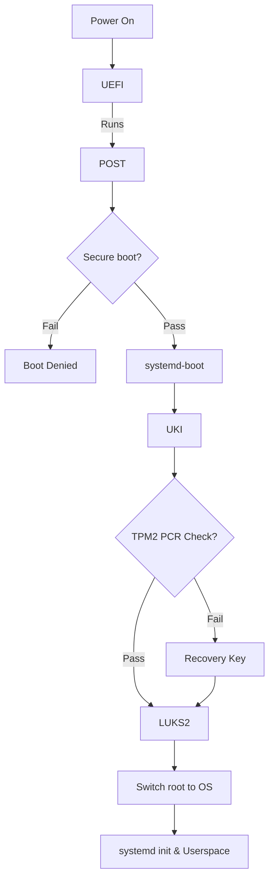

<h1 align="center">
  <a href="https://github.com/Aldin-Dreamer/Arch-Hypr-Vault">
    
  </a>
</h1>

<div align="center">
  Arch Linux — Seamless LUKS Encrypted Boot with TPM2 Auto-Unlock and Secure Boot
  <br />
  <br />
  <a href="https://github.com/Aldin-Dreamer/Arch-Hypr-Vault/issues/new?assignees=&labels=bug&template=01_BUG_REPORT.md&title=bug%3A+">Report a Bug</a>

<div align="center">
<br />

[](LICENSE)
[](https://github.com/Aldin-Dreamer/Arch-Hypr-Vault/issues?q=is%3Aissue+is%3Aopen+label%3A%22help+wanted%22)
[](https://github.com/Aldin-Dreamer)

</div>

---

An installation guide for security focused users who want a seamlessly encrypted system with LUKS encryption, TPM2 auto unlock and secure boot. This guide is meant to be used alongside the official ArchWiki Installation guide. This guide will cover how the setup works and how to replicate it yourself. Filesystem and tooling choices are also made with day-to-day usability in mind — such as Btrfs for snapshot-based rollbacks.

> ⚠️ **Warning:** This process involves disk partitioning and will erase all data
> on the target drive. Back up anything important before proceeding. There is also
> a real risk of bricking your system — read the entire guide at least once before
> running any commands. The automated scripts may also have bugs or behave
> differently across hardware.

---

<details open="open">
<summary>Table of Contents</summary>

 [Repo Structure](#1-repo-structure)<br>
 [What This Setup Achieves](#2-what-this-setup-achieves)<br>
 [Prerequisites](#3-prerequisites)<br>
 [How It All Fits Together](#4-how-it-all-fits-together)<br>
 [Disk Partitioning](#5-disk-partitioning)<br>
 [LUKS2 Encryption](#6-luks2-encryption)<br>
 [Btrfs Setup](#7-btrfs-setup)<br>
 [Base System Installation](#8-base-system-installation)<br>
 [System Configuration](#9-system-configuration)<br>
 [Bootloader — systemd-boot](#10-bootloader--systemd-boot)<br>
 [Unified Kernel Image (UKI)](#11-unified-kernel-image-uki)<br>
 [Secure Boot](#12-secure-boot)<br>
 [TPM2 Enrollment](#13-tpm2-enrollment)<br>
 [Snapper — Btrfs Snapshots](#14-snapper--btrfs-snapshots)<br>
 [Post-Installation Checklist](#15-post-installation-checklist)<br>
 [Recovery Guide](#16-recovery-guide)<br>
 [Troubleshooting](#17-troubleshooting)<br>
 [Desktop Setup](#desktop-setup)<br>
 [Contributing](#contributing)<br>
 [Authors & Contributors](#authors--contributors)<br>
 [License](#license)<br>
 [Acknowledgements](#acknowledgements)<br>
 
</details>

---
</div>

## 1. Repo Structure

```
Arch-Hypr-Vault/
├── .gitignore
├── LICENSE
├── README.md
├── RICE.md
├── .config/
└── docs/
    └── images/
        └── logo.svg
```

---
<div align="center">

## 2. What This Setup Achieves

**Security & Boot**

| Feature | Implementation |
|---|---|
| Full disk encryption | LUKS2 |
| Automatic unlock at boot | TPM2 via `systemd-cryptenroll` |
| Fallback unlock | LUKS passphrase |
| Protection against Evil Maid attacks | Secure Boot with personal keys via `sbctl` |
| Bootloader | `systemd-boot` |
| Unified boot image | UKI — kernel + initramfs + cmdline in one signed `.efi` |

**Desktop & Personal Choices** *(swap these out for your own preferences)*

| Feature | Implementation |
|---|---|
| Filesystem | Btrfs |
| Snapshot support | Snapper |
| Windows Manager | Hyprland |

>🔒**Security Scope:** This setup will protect your data at rest i.e, if your device gets stolen or is physically tampered with by malicious actors. It wont however protect your setup when it is powered on and running, so you are still vulnerable to attacks from the internet, malware and even when your laptop is stolen while it is powered on. For that you need additional measure such as a firewall, keeping you system updated and not leave it powered on in public places.


---

## 3. Prerequisites

**You will need:**
<div align="left">
  <ul>
    <li>A UEFI system (legacy BIOS doesn't support this setup)</li>
    <li>A TPM2 chip (You can check if you have it <a href="https://wiki.archlinux.org/title/Trusted_Platform_Module#Checking_TPM_support">here</a>)</li>
    <li>You are expected to have read the <a href="https://wiki.archlinux.org/title/Installation_guide">ArchWiki Installation Guide</a> and meet its prerequisites.</li>
    <li>A lot of free time especially if you are new. Dont rush this.</li>
  </ul>
</div>

> 📝 **Note:** I will be using the ArchWiki syntax so commands prefixed with `#` are run as root. In the Arch ISO you are already root so no `sudo` is needed. After installation, use `sudo` where required.

---

## 4. How It All Fits Together
**The Chain of Trust**


<div align="left">
  
**UEFI** — The UEFI is the firmware required to boot the computer. It is the root of trust, that's why physical access to the chip compromises the system regardless of software security.

**POST** — POST stands for power on self test. The firmware checks that all hardware is present and functional before handing control to the boot process. Not directly part of the chain of trust but included here for completeness.

**Secure Boot** — Before loading anything from disk, the firmware checks the cryptographic signatures on the bootloader and then the UKI before allowing them to run. If any modification has been identified, it will deny boot.

**systemd-boot** — In this setup, the systemd-boot only acts as an interface for the UKI. Its only job is to find and load the UKI

**Unified Kernel Image (UKI)** — UKI bundles the kernel, initramfs, microcode, etc., into a single EFI executable file so it can be signed by a single cryptographic signature that prevents tampering with the file. This wouldn't be possible if they were kept as separate files since each would need to be signed and verified independently, leaving gaps an attacker could exploit.

**TPM2 PCR Check** — The initramfs asks the TPM2 chip to release the LUKS key used to decrypt the LUKS volume.  The TPM checks PCR 7 (Secure Boot state and keys) and PCR 11 (the exact UKI that was loaded). If both match what was recorded at enrollment time it releases the key. If anything in the boot chain changed the PCR values won't match and the TPM refuses.

**LUKS2** — LUKS2 is the encryption scheme being used for disk encryption. Once the TPM2 releases the key, the LUKS volume will be decrypted and the root partition becomes accessible. When TPM2 refuses due to mismatch, you will simply be prompted to manually enter the LUKS key. The decrypted volume is mapped to /dev/mapper/root which the system then mounts as the root filesystem.

**Switch Root & Userspace** — The initramfs hands control over to the actual root filesystem and the Linux boot process continues as normal. systemd starts, bringing up all system services in order until the system is fully operational and ready for login.
</div>

---

## 5. Disk Partitioning

Before we begin, it is important to visualize how disk space and partitions work: <br><br>
**[ Partition 1 | Partition 2 | *Free Space* | Partition 3 | *Free space* ]** <br><br>
Given this partition layout, there is an important distinction to make here - the memory is discontinuous. If you want to increase the size of partition 2 in the future, you can only increase it upto the space in front of it, i.e, you cannot use the space available after partition 3 to increase the size of partition 2. This is why we make EFI partition first and root partition last so we can extend it if needed or even shrink it (Though i must add there is a complication in extending and shrinking partitions in this specific setup due to the LUKS encryption).

> There is a way to move partitions, but it is risky and involves rewriting the entire contents of the partition to where you want to move it. This takes a long time and there is a significant risk of data loss.<br>
> 📖 **Further reading:** [Moving Partitions — ArchWiki](https://wiki.archlinux.org/title/Fdisk#Moving_partitions)

 5.1 Partition Sceheme
 ---

Follow the Arch Wiki Installation Guide till <a href="https://wiki.archlinux.org/title/Installation_guide#Update_the_system_clock">Updating the system clock</a>

The recommended partition strategy for this setup is:
| Mount Point | Partition type | Recommended Size |
|---|---|---|
| /boot | EFI Partition | 1 GiB |
| / | Root Partition | Remainder of the space. At least 23-32 GiB |

**EFI Partition -** The EFI partition is where the Unified Kernel Image(UKI) lives with the kernel, initramfs and microcode. It is recommended to use 1 GiB for future-proofing, so if you can spare it - do it. The UKI is pretty big (~100-150 MiB) so if you plan to put multiple kernel entries, the 1 GiB headroom will be useful. If you have space constraints, you can use 512 MiB instead.

**Root Partition -** This is where the main filesystem lives and hence where you will store most of your data. The size for this partition will generally be whatever you have remaining, so choose a size as per your use case.
<!-- Mention Zram as an alternative -->
> 📝**Note:** A swap partition is not recommended. An unencrypted swap partition will hold onto data when you shut down, so anything that the kernel places into the swap file during normal operation will be saved unencrypted. If you do need swap, I recommend to use a swap file instead - it will lie under the LUKS encryption and provide the functionality of swap without compromising security. If you still require a swap partition, I recommend reading: [Swap Encryption — ArchWiki](https://wiki.archlinux.org/title/Dm-crypt/Swap_encryption)

 5.2 Creating the partitions
 ---

> ⚠️**Warning:** The following steps will wipe the disk!! Backup anything you wish to save.

The steps vary for users who are dual booting. For dual booting with windows (other dual booters are also recommended to read this), see [docs/dual-boot-windows.md](docs/dual-boot-windows.md). The following is for users on a new disk or users who are gonna wipe the entire drive for a fresh install:

Before starting with the partitoning,run: 
<div align="left">
  
```bash
# lsblk
```
</div>

You can identify which block device your disk was assigned to (Most commonly it is /dev/sda or /dev/nvme0n1). In the following steps replace '*/dev/[device]*' with your block device.<br><br>

💡**Optional — 4096 Native Sector Size:** Most solid state drives (SSD) report their logical sector size as 512 bytes, even though they use larger sector size physically. If your SSD support 4096 bytes sector size, it is recommended to format it before partitioning to improve both the performance and lifespan of your SSD. Check if it supported by running:
>⚠️**Warning:** This specific step will wipe your entire disk and not just partitions, I am warning you again to backup anything you wish to save.
>
>If you are using a USB attached external drive, read [Advanced Format — ArchWiki](https://wiki.archlinux.org/title/Advanced_Format#Advanced_Format_hard_disk_drives) before deciding to change your sector size. There are some NVMe SSD that report they support 4096 bytes sectors but they encounter unstability especially under random heavy read load. If encountering this issue, simply revert back to 512 byte sector configuration.
<div align="left">
  
  ```bash
# nvme id-ns -H /dev/[device] | grep "Relative Performance"
---------------------------------------------------------------------------------------------------------------------------------

LBA Format  0 : Metadata Size: 0   bytes - Data Size: 512 bytes - Relative Performance: 0 Best (in use)
LBA Format  1 : Metadata Size: 0   bytes - Data Size: 4096 bytes - Relative Performance: 0 Best 
```
</div>
If you see a format with 4096 bytes, thats your native sector size. If it is supported but shows 512 bytes format is in use, you can change it by running:
<div align="left">

```bash
# nvme format --lbaf=1 /dev/[device]
----------------------------------------------------------------------------------------------------------------------------------
You are about to format [device], namespace 0x1.
WARNING: Format may irrevocably delete this device's data.
You have 10 seconds to press Ctrl-C to cancel this operation.

Use the force [--force] option to suppress this warning.
Sending format operation ... 
Success formatting namespace:
```
</div>
Then verify that your logical sector size changed:
<div align="left">

  ```bash
# nvme id-ns -H /dev/[device] | grep "Relative Performance"
---------------------------------------------------------------------------------------------------------------------------------

LBA Format  0 : Metadata Size: 0   bytes - Data Size: 512 bytes - Relative Performance: 0 Best 
LBA Format  1 : Metadata Size: 0   bytes - Data Size: 4096 bytes - Relative Performance: 0 Best (in use) 
```
</div>


Now to begin partitioning your chosen drive,run:
<div align="left">
  
```bash
# fdisk /dev/[device]
```
</div>

You will enter an interactive command-line interface (CLI), you can type 'm' to get the full list of commands.

<div align="left">

- The basic commands you will use are given below: 
> → — Separates consecutive steps, each entered at a separate fdisk prompt. <br>
> ↵ — leave the field blank and press Enter to accept the default value.
```bash
1. New GPT Table:               g
2. Print the partition table:   p
3. Delete Partition:            d → [partition_number]
4. EFI Partition:               n → ↵ (This will be your EFI_partition_number) → ↵ → +1G (Size of the partition)
5. Root Partition:              n → ↵ (This will be your root_partition_number) → ↵ → ↵ (This will allocate all the remaining free space available to the disk) 
6. EFI Type:                    t → [EFI_partition_number] → 1 (changing the partition_type to EFI system) 
7. Save & Exit:                 w
8. Exit without saving:         q
```
>📝**Note:**  After the EFI partitioning step if your partition contains filesystem data from previous Operating System, you might be prompted to remove vfat signature. Type 'Y' to delete the signature to ensure a clean partition
- Your final partition table should look like this:
```bash
# fdisk -l
---------------------------------------------------------------------------------------------------------------------------------
Disk /dev/[device]: [size] GiB, [bytes] bytes, [total_sectors] sectors
Disk model: [Manufacturer_model_name]              
Units: sectors of 1 * 512 = 512 bytes
Sector size (logical/physical): 512 bytes / 4096 bytes
I/O size (minimum/optimal): 512 bytes / 512 bytes
Disklabel type: [gpt/dos]
Disk identifier: [UNIQUE-ID-OR-GUID]
  
Device                                 Start        End        Sectors   Size       Type
/dev/[device][EFI_partition_number]    2048       [sector]     [count]    1G    EFI System
/dev/[device][root_partition_number]  [sector]    [sector]     [count]  [size]  Linux filesystem
```
</div>


---

## 6. LUKS2 Encryption

Once the partitions have been created, each newly created partition must be formatted with an appropriate file system. 
For the EFI partition, we will format it with FAT32 filesystem. This is the recommended option as the choice of filesystem needs to adhere to [UEFI specifications](https://uefi.org/specs/UEFI/2.11/13_Protocols_Media_Access.html#file-system-format-1). To create it, run:
>⚠️**Warning:** Only format the EFI system partition if you created it during the partitioning step. If there already was an EFI system partition on disk beforehand, reformatting it can destroy the boot loaders of other installed operating systems.
<div align="left">

```bash
# mkfs.fat -F 32 /dev/[device][EFI_partition_number]
```
</div>

For the root partition, before we create the filesystem, we need to encrypt it. We are encrypting the partition by writing a LUKS2 header at the beginning of it, turning it into a LUKS volume. The header stores the encryption metadata and key slots, and everything after it would be encrypted data. To create the LUKS volume, run:
>📝**Note:** In the previous section, if you did not do the optional step of changing the logical sector size of you SSD, omit the *--sector-size 4096* in the below command.
<div align="left">
  
```bash
# cryptsetup luksFormat --sector-size 4096 /dev/[device][root_partition_number]
```
</div>
You will be prompted to enter a password for unlocking the encryption. This will be your fallback passphrase if the TPM2 auto-unlock fails.

>❗**IMPORTANT:** Make sure to use a sufficiently secure password. Even though the keyslot will be wiped later, SSD wear-leveling can cause it to persist after removal for an indefinite amount of time. Also make sure to physically write this down or save it somewhere secure, if you lose this passphrase and TPM2 auto-unlock fails — you will be locked out of your system forever with no way to recover it.

Now to create the filesystem for root partition, first open the LUKS volume to access the root partition. Run the command and enter the password:
<div align="left">
  
```bash
# cryptsetup open /dev/[device][root_partition_number] root
```
</div>

You can verify if your root partition has been successfully encrypted by running lsblk. Instead of the root partition you created, you will see /dev/mapper/root:
<div align="left">

```bash
# lsblk
```
</div>

Then create a filesystem on the unlocked root partition. This is where you can choose your preferred filesystem. If you are following this guide exactly, it would be the btrfs filesystem. 

> 📖 **Filesystem Reference:** Watch this [beginner friendly overview](https://www.youtube.com/watch?v=4kMt5RtDZ7g) or read the [File Systems — ArchWiki](https://wiki.archlinux.org/title/File_systems#Types_of_file_systems) for a detailed comparison. If you choose a different filesystem, replace mkfs.btrfs in the command below with the appropriate command for your choice.
<div align="left">
  
```bash
# mkfs.btrfs /dev/mapper/root
```
</div>
Then mount both the root partition and EFI partitions:
<div align="left">
  
```bash
# mount /dev/mapper/root /mnt
# mount --mkdir /dev/[device][EFI_partition_number] /mnt/boot
```
</div>

---

## 7. Btrfs Setup
> 📝**Note:** This section is only relevant to you if you chose btrfs as your filesystem while formatting your root partition. Others can skip to the next section.

**Btrfs Subvolumes** — They function like independent filesystems that can be mounted separately in a hierarchy, providing the benefits of partitions without being actual physical partitions. Because the subvolumes work at the filesystem level rather than the block level, they can be dynamically resized as needed making them more flexible. Note that, because subvolumes are at the filesystem level, the subvolumes combined are limited by the storage space of the physical partition they are occupying. This is especially useful in this setup as we can encrypt them with a single LUKS passphrase.
 
💡**Suggested Btrfs Filesystem Layout:**

| Subvolume | Mountpoint | Purpose | CoW | Snapshots | Compression |
|---|---|---|---|---|---|
| @ | / | **The OS Core**. Allows for full system rollbacks without affecting your user-space data. | Yes | Yes | Yes |
| @home | /home  | **User Space**. Ensures your data remains in the "present" even if the OS is rolled back.  | Yes | Yes | Yes |
| @snapshots | /.snapshots | **Time Machine**. A dedicated storage for snapshots. Keeps recovery points isolated from the active OS. | Yes | No | Yes |
| @var_log | /var/log | **Troubleshooting**. Preserves system logs across rollbacks. Essential for troubleshooting failure after a restore. | Yes | No | Yes |
| @var_cache | /var/cache | **Package Archive**. Saves disk space by keeping temporary files and package archives separate | Yes | No | Yes |
| @swap | /swap | **Swap**. Swapfile to prevent "Out of memory" crashes when RAM is full. Regardless of how much RAM you have, the Linux kernel is designed to manage background tasks more efficiently with swap . Excluded from snapshots to prevent filesystem errors and overhead. | No | No | No |

> 📝**Note:** In swap subvolume, CoW, compression, snapshots are all disabled because all three actively break or hurt swapfile performance. Btrfs actively forbids activating a swapfile on a CoW or compressed file.

>🧠**Extra:** If you ever plan to tinker with a Virtual Machine (VM), I suggest making a separate subvolume for the VM and disabling CoW (copy on write), snapshots and compression. This is because VM images are massive files that are constantly being written to. The COW feature of btrfs can cause massive fragmentation on these large files, similarly, snapshots and compression can hurt performance.
>
> | Subvolume | Mountpoint | CoW | Snapshots | Compression |
> |---|---|---|---|---|
> | @libvirt | /var/lib/libvirt/images | No | No | No |

To create the subvolume, run:
<div align="left">
  
```bash 
# btrfs subvolume create /path/to/subvolume
---------------------------------------------------------------------------------------------------------------------------------
btrfs subvolume create /mnt/@
btrfs subvolume create /mnt/@home
btrfs subvolume create /mnt/@snapshots
btrfs subvolume create /mnt/@var_log
btrfs subvolume create /mnt/@var_cache
btrfs subvolume create /mnt/@swap
btrfs subvolume create /mnt/@libvirt
```
</div>

We can mount the subvolumes with its corresponding mount options. The commonly used options are:
<div align="left">
  
- ```subvol=PATH``` — mounts subvolume based on its relative path from top-level root. Without this options, Btrfs will default to mounting it to top-level root.
- ```compress=<type[:level]>``` — Enables compression and automatically evaluates each file's compressibility and skips compression for files that don't compress well. When you read the file, the processor will decompress it on the fly.
- ```noatime``` — Linux kernel automatically assigns metadata to each file and one of them is atime. It records the last accessed time, this introduces unnecessary writes whenever you open a file. For Btrfs it is recommended to use this option to disable atime.
</div>

> 📖 **For the full options list:** [Mount options — ArchWiki](https://man.archlinux.org/man/btrfs.5#MOUNT_OPTIONS)

First we have to unmount the top-level directory and remount it with the ```subvol``` option pointing to @ so that the subvolume becomes your root directory. Then you create the corresponding mountpoint directory for each subvolume and mount the subvolume with their corresponding options. Run:
<div align="left">
  
```bash
# umount /mnt
# mount -o subvol=@,compress=zstd,noatime /dev/mapper/root /mnt
# mkdir -p /mnt/{home,.snapshots,var/log,var/cache,swap,var/lib/libvirt/images}
# mount -o subvol=@home,compress=zstd,noatime /dev/mapper/root /mnt/home
# mount -o subvol=@snapshots,compress=zstd,noatime /dev/mapper/root /mnt/.snapshots
# mount -o subvol=@var_log,compress=zstd,noatime /dev/mapper/root /mnt/var/log
# mount -o subvol=@var_cache,compress=zstd,noatime /dev/mapper/root /mnt/var/cache
# mount -o subvol=@libvirt,noatime /dev/mapper/root /mnt/var/lib/libvirt/images
# mount -o subvol=@swap,noatime /dev/mapper/root /mnt/swap
```
</div>

You must disable CoW before writing any data to the subvolume. If you enable it after, the existing data will retain CoW properties. To disable CoW on a subvolume, run:
<div align="left">
  
```bash
# chattr +C /path/to/subvolume_mountpoint
---------------------------------------------------------------------------------------------------------------------------------
# chattr +C /mnt/var/lib/libvirt/images
# chattr +C /mnt/swap
```
</div>

To verify that CoW has been disabled, run:
<div align="left">
  
```bash
# lsattr -d /mnt/swap
---------------------------------------------------------------------------------------------------------------------------------
---------------C------ /mnt/swap
```
</div>

If the output comes with a capital 'C' then it means CoW has been disabled. This will persist after unmounting, rebooting and system updates.

To make the @swap subvolume a swapfile, run:
<div align="left">
  
```bash
# btrfs filesystem mkswapfile --size [size] --uuid clear /swap/swapfile
# swapon /swap/swapfile
```
>📝**Note:** The ```swapon``` command only activates swap for the current session. To make it persisten across reboots, it needs to be added to fstab which will be done in the next section.

>💡**Swapfile size recommendation:** The size of swapfile depends on the amount of RAM your system has and whether you want to hibernate (suspend to disk).
> - If you want to hibernate, then the swapfile should have the same size as the amount of RAM plus some safety margin for headroom. If you use hibernation with memory compression, then you will need more space, the golden rule will be ```size of RAM + sqrt(size of RAM)```.
> - If you do not want to hibernate (Recommended for most users), then the swapfile only needs to be 4 to 8 GiB depending on the amount of RAM. 4 GiB for 8 and 16 GiB RAM and 8 for 32+ GiB of RAM.
</div>

To verify swap has been activated, run the below command and a similar output will be seen:
<div align="left">
  
```bash
# swapon --show
---------------------------------------------------------------------------------------------------------------------------------
NAME           TYPE      SIZE USED PRIO
/swap/swapfile file      4.0G   0B   -2
```
</div>

---

## 8. Base System Installation

<!-- pacstrap command with your package list.
     genfstab — and remind the reader to verify it looks correct. -->
### Install essential packages

At this stage you need to install some essential packages aside from the base package for your setup:
<div align="left">
  
- [CPU Microcode](https://wiki.archlinux.org/title/Microcode) — Depending on if your processor is amd or intel, you need to install its microcode. Processor manufacturers release stability and security updates to the processor microcode. These updates provide bug fixes that can be critical to the stability of your system.
- [Userspace Utilities for filesystems](https://wiki.archlinux.org/title/File_systems) — Depending on the choice of file system, intall its corresponding userspace utilities program. In case of Btrfs, it will be [btrfs-progs](https://archlinux.org/packages/?name=btrfs-progs). These helps in using the corresponding file system's features.
- [Network Manager](https://wiki.archlinux.org/title/Network_configuration#Network_managers) — A network manager lets you manage network connection settings in so called network profiles to facilitate switching networks. It is required if you ever plan on connecting to the internet or do any kind of networking. The recommended option for any standard daily driver desktop that works out of the box is [networkmanager](https://wiki.archlinux.org/title/NetworkManager).
- [Text Editor](https://wiki.archlinux.org/title/List_of_applications/Documents#Console) — Text editors allows us to read and write files comfortably from theh console.
- [tpm2-tools](https://archlinux.org/packages/?name=tpm2-tools) and [tpm2-tss](https://archlinux.org/packages/core/x86_64/tpm2-tss/) — TPM2 userspace tool and TPM2 library that is required for setting up TPM2.
- [sbctl](https://archlinux.org/packages/?name=sbctl) — A user-friendly tool to handle secure boot keys.
</div>

The base, linux and linux-firmware packages are mandatory to install. Append the name of the essential packages you are installing to the below command, run:
<div align="left">

```bash
# pacstrap -K /mnt base linux linux-firmware
```

>📝**Note:** To install more packages or package groups, append the names to the ```pacstrap``` command above (space separated) or use ```pacman``` to install them while chrooted into the new system. You can also replace linux with the kernel package of your choice.

>💡**Optional Tools:** Some optional tools that are recommended to install are:
> - [efibootmgr](https://wiki.archlinux.org/title/Unified_Extensible_Firmware_Interface#efibootmgr) — A useful tool for mmanaging EFI boot entries. This is used as a diagnostic tool in this guide.
> - [Linux man pages](https://wiki.archlinux.org/title/Man_page) — If you want to access the official Linux documentations, you can install [man-db](https://archlinux.org/packages/?name=man-db), [man-pages](https://archlinux.org/packages/?name=man-pages) and [texinfo](https://archlinux.org/packages/?name=texinfo).
</div>

### Fstab

To get needed file systems mounted on startup, generate an fstab file with persistent block device naming using ```genfstab```. It reads the current mount state and writes it to fstab, so whatever is mounted right now gets recorded. Run:
<div align="left">
  
```bash
# genfstab -U /mnt >> /mnt/etc/fstab
```
</div>

Check the resulting ```/mnt/etc/fstab``` file, and edit it in case of errors. 


---
## 9. System Configuration

<!-- Everything inside arch-chroot:
     timezone, locale, hostname, root password, user creation, sudo, services to enable -->

---

## 10. Bootloader — systemd-boot

<!-- bootctl install, loader.conf, and why you chose the options you did -->

---

## 11. Unified Kernel Image (UKI)

### 11.1 What is a UKI and Why Use One

<!-- Explain what a UKI bundles and the security benefit over separate kernel + initramfs entries.
     Link to docs/uki-explained.md for the deep dive. -->

### 11.2 Configuring mkinitcpio

<!-- /etc/kernel/cmdline — how to find your LUKS UUID and what parameters go here.
     /etc/mkinitcpio.conf — the HOOKS line, especially why systemd hooks are used.
     /etc/mkinitcpio.d/linux.preset — enabling UKI output. -->

### 11.3 Building the UKI

---

## 12. Secure Boot

### 12.1 Enrolling Your Own Keys with sbctl

<!-- sbctl create-keys and enroll-keys.
     Note on --microsoft flag and when to include/omit it. -->

### 12.2 Signing the UKI

### 12.3 Automating Re-signing on Kernel Updates

<!-- The pacman hook. Show the hook file and explain when it runs. -->

---

## 13. TPM2 Enrollment

### 13.1 Understanding PCR Policies

<!-- Which PCRs are you binding to and why?
     What does it mean when PCR values change?
     Link to docs/tpm2-pcr-policy.md for the deep dive. -->

### 13.2 Enrolling the LUKS Volume

<!-- systemd-cryptenroll command.
     Updating /etc/crypttab.initramfs.
     Rebuilding and re-signing the UKI after enrollment. -->

### 13.3 Testing and Fallback

<!-- What should happen on a successful reboot?
     What does fallback to passphrase look like, and is that expected?
     When does the reader need to re-enroll? -->

---

## 14. Snapper — Btrfs Snapshots

<!-- snapper create-config, retention settings, enabling timers.
     Mention snap-pac for automatic pre/post snapshots around pacman. -->

---

## 15. Post-Installation Checklist

<!-- A checklist the reader runs through before their first reboot.
     Each item should be something that can actually be verified with a command. -->

- [ ]
- [ ]
- [ ]

---

## 16. Recovery Guide

<!-- What to do if the system won't boot.
     The basic steps: boot ISO → open LUKS → mount Btrfs → chroot.
     Link to docs/recovery.md for detailed scenarios. -->

---

## 17. Troubleshooting

<!-- Common failure points and their fixes.
     Add to this as you hit issues during your own installs. -->

**[Problem]**
> Cause and fix

**[Problem]**
> Cause and fix

---

## Desktop Setup

For the Hyprland rice and desktop configuration see [RICE.md](RICE.md)

---

## Contributing

Contributions, issues and feature requests are welcome. Feel free to check the [issues page](https://github.com/GITHUB_USERNAME/REPO_SLUG/issues) if you want to contribute.

---

## Authors & Contributors

The original setup of this repository is by [Aldin-Dreamer](https://github.com/Aldin-Dreamer).

For a full list of all authors and contributors, see [the contributors page](https://github.com/GITHUB_USERNAME/REPO_SLUG/contributors).

---

## License

This project is licensed under the **MIT license**.

See [LICENSE](LICENSE) for more information.

---

## Acknowledgements


-
-
