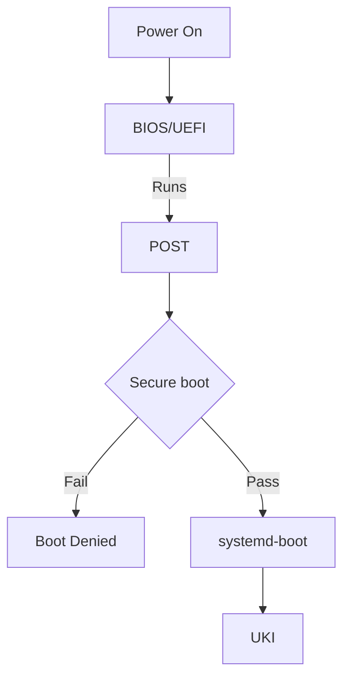

<h1 align="center">
  <a href="https://github.com/Aldin-Dreamer/Arch-Hypr-Vault">
    <!-- Please provide path to your logo here -->
    
  </a>
</h1>

<div align="center">
  Arch Linux — Seamless LUKS Encrypted Boot with TPM2 Auto-Unlock and Secure Boot
  <br />
  <br />
  <a href="https://github.com/Aldin-Dreamer/Arch-Hypr-Vault/issues/new?assignees=&labels=bug&template=01_BUG_REPORT.md&title=bug%3A+">Report a Bug</a>

<div align="center">
<br />

[](LICENSE)
[](https://github.com/Aldin-Dreamer/Arch-Hypr-Vault/issues?q=is%3Aissue+is%3Aopen+label%3A%22help+wanted%22)
[](https://github.com/Aldin-Dreamer)

</div>

---

An installation guide for security focused users who want a seamlessly encrypted system with LUKS encryption, TPM2 auto unlock and secure boot. This guide is meant to be used alongside the official Arch Wiki Installation guide. This guide will cover how the setup works and how to replicate it yourself and what the automated install scripts do. Filesystem and tooling choices are also made with day-to-day usability in mind — such as Btrfs for snapshot-based rollbacks.

> ⚠️ **Warning:** This process involves disk partitioning and will erase all data
> on the target drive. Back up anything important before proceeding. There is also
> a real risk of bricking your system — read the entire guide at least once before
> running any commands. The automated scripts may also have bugs or behave
> differently across hardware.

---

<details open="open">
<summary>Table of Contents</summary>

 [Repo Structure](#1-repo-structure)<br>
 [What This Setup Achieves](#2-what-this-setup-achieves)<br>
 [Prerequisites](#3-prerequisites)<br>
 [How It All Fits Together](#4-how-it-all-fits-together)<br>
 [Disk Partitioning](#5-disk-partitioning)<br>
 [LUKS2 Encryption](#6-luks2-encryption)<br>
 [Btrfs Setup](#7-btrfs-setup)<br>
 [Base System Installation](#8-base-system-installation)<br>
 [System Configuration](#9-system-configuration)<br>
 [Bootloader — systemd-boot](#10-bootloader--systemd-boot)<br>
 [Unified Kernel Image (UKI)](#11-unified-kernel-image-uki)<br>
 [Secure Boot](#12-secure-boot)<br>
 [TPM2 Enrollment](#13-tpm2-enrollment)<br>
 [Snapper — Btrfs Snapshots](#14-snapper--btrfs-snapshots)<br>
 [Post-Installation Checklist](#15-post-installation-checklist)<br>
 [Recovery Guide](#16-recovery-guide)<br>
 [Troubleshooting](#17-troubleshooting)<br>
 [Desktop Setup](#desktop-setup)<br>
 [Contributing](#contributing)<br>
 [Authors & Contributors](#authors--contributors)<br>
 [License](#license)<br>
 [Acknowledgements](#acknowledgements)<br>
 
</details>

---
</div>

## 1. Repo Structure

```
Arch-Hypr-Vault/
├── .gitignore
├── LICENSE
├── README.md
├── RICE.md
├── .config/
└── docs/
    └── images/
        └── logo.svg
```

---
<div align="center">

## 2. What This Setup Achieves

**Security & Boot**

| Feature | Implementation |
|---|---|
| Full disk encryption | LUKS2 |
| Automatic unlock at boot | TPM2 via `systemd-cryptenroll` |
| Fallback unlock | LUKS passphrase |
| Protection against Evil Maid attacks | Secure Boot with personal keys via `sbctl` |
| Bootloader | `systemd-boot` |
| Unified boot image | UKI — kernel + initramfs + cmdline in one signed `.efi` |

>🔒**Security Scope:** This setup will protect your data at rest i.e, if your device gets stolen or is physically tampered with by malicious actors. It wont however protect your setup when it is powered on and running, so you are still vulnerable to attacks from the internet, malware and even when your laptop is stolen while it is powered on. For that you need additional measure such as a firewall, keeping you system updated and not leave it powered on in public places.

</div>

---

## 3. Prerequisites

**You will need:**
<div align="left">
  <ul>
    <li>A UEFI system (legacy BIOS doesn't support this setup)</li>
    <li>A TPM2 chip (You can check if you have it <a href="https://wiki.archlinux.org/title/Trusted_Platform_Module#Checking_TPM_support">here</a>)</li>
    <li>You are expected to have read the <a href="https://wiki.archlinux.org/title/Installation_guide">Arch Wiki Installation Guide</a> and meet its prerequisites.</li>
    <li>A lot of free time especially if you are new. Dont rush this.</li>
  </ul>
</div>

---

## 4. How It All Fits Together




<div align="left">
  
**UEFI/BIOS** — Initializes the hardware and reads the boot entries from NVRAM to determine which EFI partition.

**Secure Boot** — Checks cryptographic signatures on the bootloader and UKI before 
allowing them to run. If any modification has been identified, it will deny boot.

**systemd-boot** — 

**Unified Kernel Image (UKI)** — 

**TPM2 PCR Check** — 
**Btrfs Mount** — 
</div>

---

## 5. Disk Partitioning

Follow the Arch Wiki Installation Guide till <a href="https://wiki.archlinux.org/title/Installation_guide#Update_the_system_clock">Updating the system clock</a>

The recommended partition strategy for this setup is:
| Mount Point | Partition type | Recommended Size |
|---|---|---|
| /boot | EFI Partition | 1 GiB |
| / | Root Partition | Remainder of the space. Atleast 23-32 GiB |

**EFI Partition -** The EFI partition is where the Unified Kernel Image(UKI) lives with the kernel, initramfs and microcode. It is recommended to use 1 GiB for future-proof, so if you can spare it - do it. The UKI is pretty big (~100-150MB) so if you plan to put multiple kernel entries, the 1 GiB headroom will be useful. If you have space constraints, you can use 512 MiB instead.
<div align="left">
  
```bash
# fdisk /dev/sda
```

</div>

**Root Partition -** This is where the main filesystem lives and hence where you will store most of your data. The size for this partition will generally be whatever you have remaining.

> **Note:** A swap partition is not recommended. An unencrypted swap partition will hold onto data when you shut down, so anything that the kernel places into the swap file during normal operation will be saved unencrypted. If you do need swap, I recommend to use a swap file instead - it will lie under the LUKS encryption and provide the functionality of swap without compromising security. If you still require a swap partition, I recommend reading <a href="https://wiki.archlinux.org/title/Dm-crypt/Swap_encryption">this</a>.

### 5.1 Format the partitions


---

## 6. LUKS2 Encryption

<!-- The format command and the options you chose — explain briefly why each option matters.
     How do you open the container after formatting?
     What should the reader do with their passphrase? -->

---

## 7. Btrfs Setup

### 7.1 Format and Mount

### 7.2 Subvolume Layout

<!-- Which subvolumes are you creating and why?
     A table of subvolume → mount point → snapshotted yes/no is useful here. -->

### 7.3 Mount Options

<!-- What mount options are you using (noatime, compress=zstd, etc.) and what does each one do? -->

---

## 8. Base System Installation

<!-- pacstrap command with your package list.
     genfstab — and remind the reader to verify it looks correct. -->

---

## 9. System Configuration

<!-- Everything inside arch-chroot:
     timezone, locale, hostname, root password, user creation, sudo, services to enable -->

---

## 10. Bootloader — systemd-boot

<!-- bootctl install, loader.conf, and why you chose the options you did -->

---

## 11. Unified Kernel Image (UKI)

### 11.1 What is a UKI and Why Use One

<!-- Explain what a UKI bundles and the security benefit over separate kernel + initramfs entries.
     Link to docs/uki-explained.md for the deep dive. -->

### 11.2 Configuring mkinitcpio

<!-- /etc/kernel/cmdline — how to find your LUKS UUID and what parameters go here.
     /etc/mkinitcpio.conf — the HOOKS line, especially why systemd hooks are used.
     /etc/mkinitcpio.d/linux.preset — enabling UKI output. -->

### 11.3 Building the UKI

---

## 12. Secure Boot

### 12.1 Enrolling Your Own Keys with sbctl

<!-- sbctl create-keys and enroll-keys.
     Note on --microsoft flag and when to include/omit it. -->

### 12.2 Signing the UKI

### 12.3 Automating Re-signing on Kernel Updates

<!-- The pacman hook. Show the hook file and explain when it runs. -->

---

## 13. TPM2 Enrollment

### 13.1 Understanding PCR Policies

<!-- Which PCRs are you binding to and why?
     What does it mean when PCR values change?
     Link to docs/tpm2-pcr-policy.md for the deep dive. -->

### 13.2 Enrolling the LUKS Volume

<!-- systemd-cryptenroll command.
     Updating /etc/crypttab.initramfs.
     Rebuilding and re-signing the UKI after enrollment. -->

### 13.3 Testing and Fallback

<!-- What should happen on a successful reboot?
     What does fallback to passphrase look like, and is that expected?
     When does the reader need to re-enroll? -->

---

## 14. Snapper — Btrfs Snapshots

<!-- snapper create-config, retention settings, enabling timers.
     Mention snap-pac for automatic pre/post snapshots around pacman. -->

---

## 15. Post-Installation Checklist

<!-- A checklist the reader runs through before their first reboot.
     Each item should be something that can actually be verified with a command. -->

- [ ]
- [ ]
- [ ]

---

## 16. Recovery Guide

<!-- What to do if the system won't boot.
     The basic steps: boot ISO → open LUKS → mount Btrfs → chroot.
     Link to docs/recovery.md for detailed scenarios. -->

---

## 17. Troubleshooting

<!-- Common failure points and their fixes.
     Add to this as you hit issues during your own installs. -->

**[Problem]**
> Cause and fix

**[Problem]**
> Cause and fix

---

## Desktop Setup

For the Hyprland rice and desktop configuration see [RICE.md](RICE.md)

---

## Contributing

Contributions, issues and feature requests are welcome. Feel free to check the [issues page](https://github.com/GITHUB_USERNAME/REPO_SLUG/issues) if you want to contribute.

---

## Authors & Contributors

The original setup of this repository is by [Aldin-Dreamer](https://github.com/Aldin-Dreamer).

For a full list of all authors and contributors, see [the contributors page](https://github.com/GITHUB_USERNAME/REPO_SLUG/contributors).

---

## License

This project is licensed under the **MIT license**.

See [LICENSE](LICENSE) for more information.

---

## Acknowledgements


-
-
